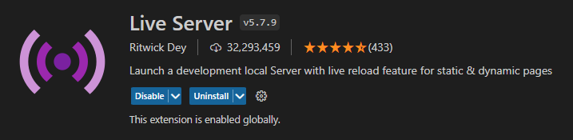

<p align="center">
  <h1 align="center">CV Generator</h1>
  <h4 align="center">Resume CV with dark/light mode and PDF export</h4>
</p>

<p align="center">
  <a href="https://developer.mozilla.org/en-US/docs/Web/CSS">
    
  </a>

  <a href="https://fontawesome.com/">
    
  </a>

  <a href="https://developer.mozilla.org/en-US/docs/Glossary/HTML5">
    
  </a>

  <a href="https://ekoopmans.github.io/html2pdf.js/">
    
  </a>
  
  <a href="https://developer.mozilla.org/en-US/docs/Web/JavaScript">
     
  </a> 
</p>

<p align="center">
  
  
  
</p>

## About

CV Generator is an **HTML5**, **CSS3** and **Javascript** only project that allows you to create a modern, clean and personalized CV according to your tastes. It also allows you to have a CV in **dark mode** but also to be able to export it directly in **PDF** format.

This project is obviously **responsive**: for *desktop*, *laptop* and *tablet* screens, the CV will be displayed in its classic form as a PDF. While for *mobile phone* screens, this one will be presented as a small showcase website.

To export the CV in PDF format, the **html2pdf.js** library was used and the version is *0.9.3*. (this is the most stable version) html2pdf.js is a Client-side HTML-to-PDF rendering using pure JS, she converts any webpage or element into a printable PDF entirely client-side using **html2canvas** and **jsPDF**. ([html2pdf.js Github repo](https://github.com/eKoopmans/html2pdf.js "Go to the html2pdf.js Github repo")).

For the icons, the Internet's icon library and toolkit **Font Awesome** was used.

> <sub>The project was created by inspiring me from the <a href="https://github.com/bedimcode">bedimcode</a> project called **Responsive Resume Cv Smith** (project link: <a href="https://github.com/bedimcode/responsive-resume-cv-smith">responsive-resume-cv-smith</a>) and watching the associated Youtube video of Bedimcode: <a href="https://www.youtube.com/watch?v=oYjseP_Qhv4">Responsive Resume Cv Website Using HTML CSS And JavaScript | Light/Dark Theme & Export PDF</a></sub>

### Features

This is the **first version** of the project (*v1.0*). To improve the project in a new version (*v2.0*), CV customization could be added: choice of a color palette other than white/black, addition of other less common sections. But also adding data in a `.js` file instead of touching the `index.html` file.

- [x] Light/dark mode toggle
- [x] Download to PDF
- [x] Responsive
- [x] Mobile screen mode
- [ ] Customization

## Demo

Live demo here: [live demo](https://leag76.github.io/cv-generator/ "Go to the live demo")

## Get started

### Prerequisites
The only thing you need is a text editor or an IDE that allows connection to a local server (I recommend Visual Studio Code with its Live Server extension)

### Installation

To start, let's go clone the project:

```
git clone https://github.com/LeaG76/cv-generator.git
```

Then, open it from your favorite text editor or IDE, normally you should have this project structure:

```bash
├── assets/
│   ├── javascripts/
│   │   ├── main.js
│   │   ├── html2pdf.v0.8.0.bundle.min.js
│   │   └── html2pdf.v0.9.3.bundle.min.js
│   ├── pdf/
│   │   ├── myResumeCV-dark.pdf
│   │   └── myResumeCV-light.pdf
│   ├── pictures/
│   │   ├── favicon/
│   │   │   └── ...
│   │   ├── results/
│   │   │   └── myResumeCV-light.png
│   │   ├── profile.png
│   │   └── profile.txt
│   └── stylesheets/
│       ├── layout.css
│       └── style.css
├── index.html
└── README.md
```

> <sub>**Warning**: To carry out this project, you must be connected to a *local server*, more particularly for the generation in **PDF** and for the display of the image from the txt file. More details [below](#configuration "Go to configuration")</sub>
>> <sub>If you can't connect to a local server, no problem, don't worry! You can simply upgrade to an older version of **html2pdf.js**. Version *0.8.0* can save a pdf by just launching the `.html` file on a browser without going through a local server</sub>

### Configuration

<details open>
  <summary><b>Local server</b></summary>
  <br>
  As said before, to be able to use this project, you will have to be connected to a local server
  
  Plusieurs éditeurs de textes ont la fonctionnalité de local server (like VSCode, SublimeText, Atom, ...)

  <p align="center">
    </br>
    
    
  </p>
</details>

<details close>
  <summary><b>Convert your profile picture into an url in Base64</b></summary>
  <br>

  To convert your image to a Base64 url, you can go to websites allowing this action to be carried out such as: [Base64 Image](https://www.base64-image.de/ "Go to Base64 Image") or [elmah.io](https://elmah.io/tools/base64-image-encoder "Go to elmah.io")

  Plusieurs façons :

  - Avec un serveur local (fichier main.js -> profile.txt)
  - Sans serveur local (mettre url directement dans la src de l'image dans le fichier .html)

  Convert your logo image to Base64 and replace this :

```html

```

by this :

```html

```
</details>

<details close>
  <summary><b>Create multiples size Favicons</b></summary>
  <br>
</details>

## Usage

### Put your informations

You can therefore modify the index.html file to put your information. If you want different icons, you can go to [Font Awesome](https://fontawesome.com/search?m=free&o=r "Go to Font Awesome") and select icons from a large selection of free and open-source icons

### Customize your resume CV

- changer palette couleur
- changer police
- changer icons Font Awesome

## Examples

## TodoList

- Change html2pdf Version 0.8.0 -> 0.9.3
- Création d'un fichier js dans lequel on met le contenu du CV
